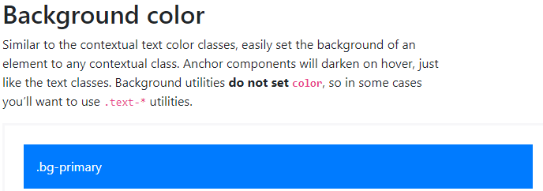
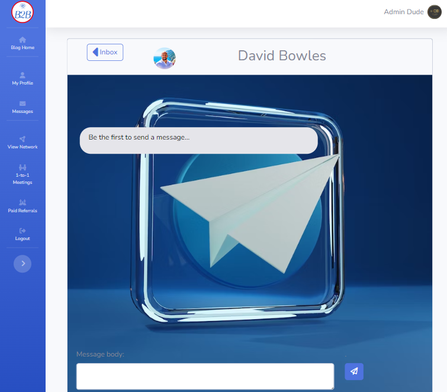

# B2B Net - Business Networking Platform

B2B-Net stands at the forefront of business networking, tailored to amplify collaboration and prosperity within distinct localities. Designed as exclusive, paid groups, each with its own database and membership, B2B-Net serves as a dynamic hub for businesses to cultivate meaningful connections.

Key Features:

## Referral Excellence

The Referral Logging System streamlines revenue opportunities, letting businesses log and manage referrals effortlessly.
An integrated commission system incentivizes active participation, rewarding businesses with a 5% commission on successful referrals.

## Strategic Meetings

The One-to-One Meeting Booking feature fosters direct collaboration, encouraging businesses to schedule personalized meetings.
This capability enhances relationship-building, opening pathways for shared growth opportunities within the local community.

## Additional Features

### Blog Posts for Community Updates

Stay informed with group meetings, business services, and community highlights through interactive blog posts.

### Direct Messaging Chat App

Enhance communication through a dedicated chat app, enabling users to connect through direct messages for seamless interaction.

### Comprehensive User Profiles

Elevate networking with detailed user profiles, providing insights into businesses, services, and expertise.

### Data-Driven Dashboard

A powerful dashboard analyzes referral data, offering insights into network performance, trends, and opportunities for strategic growth.

## Purpose and Impact

B2B-Net goes beyond conventional networking platforms by empowering paid, exclusive groups with tailored databases. This unique approach enriches the local business ecosystem, driving economic growth through structured referrals and fostering partnerships that thrive on mutual benefit.

## Your Business, Your Network, Your Success

B2B-Net is more than a platform; it's a strategic partner for businesses invested in their local community. Unlock the full potential of your network, stay informed through dynamic blog posts, engage effortlessly with the chat app, and harness the power of data through an intuitive dashboard. Elevate your business connections with B2B-Net.

***AM I Responsive***

<https://www.bootdey.com/snippets/view/light-contact-list> snippets

<!-- # https://stackoverflow.com/questions/43696074/django-private-messaging-conversation-view -->

Links to Git hub repository and live site login below with a test user credentials here if you dont fancy going through signup yourself(the passowrd here is generic and not one i have used previously or will in the future)

Username:

password:

[Git Hub Repo - B2B Net](https://github.com/Bowlesy666/b2b-net)

[Live deployed site - B2B Net login](https://b2bproject-321684f42c8f.herokuapp.com/)

[Live deployed site - 404 page](https://b2bproject-321684f42c8f.herokuapp.com/404.html/)

___

## Contents

* [UX](#ux)
  * [User Stories](#User-Stories)

* [Design](#design)
  * [Wireframes](#wireframes)
  * [Colour Scheme](#colour-scheme)
  * [Typography](#typography)
  * [Imagery](#imagery)

* [Features](#features)
  * [General Features](#general-features)
  * [Future Implementations](#future-implementations)
  * [Accessibility](#accessibility)

* [Technologies Used](#technologies-used)
  * [Languages Used](#languages-used)
  * [Frameworks, Libraries & Programs Used](#frameworks-libraries--programs-used)

* [Deployment & Local Development](#deployment--local-development)
  * [Deployment](#deployment)
  * [Local Development](#local-development)
    * [How to Fork](#how-to-fork)
    * [How to Clone](#how-to-clone)

* [Testing](#testing)

* [Credits](#credits)
  * [Code Used](#code-used)
  * [Content](#content)
  * [Media](#media)
  * [Acknowledgments](#acknowledgments)

___

## UX

### User Stories

#### Target Audience

The target audience for **B2B-Net** includes:

* **Local Businesses Seeking Growth:**
  * Aspiring to expand business connections and increase revenue through strategic collaborations.

* **Community-Focused Entrepreneurs:**
  * Individuals committed to fostering community development and supporting local businesses.

* **Networking Enthusiasts:**
  * Professionals interested in a platform that facilitates effective and meaningful networking within their locality.

#### Goals

The goals for **B2B-Net** are:

* **Refine Business Connections:**
  * Provide a seamless platform for businesses to log and manage referrals, enhancing revenue opportunities.

* **Streamline Collaboration:**
  * Facilitate one-to-one meetings, encouraging collaboration and shared growth opportunities among local businesses.

* **Community Engagement through Blog Posts:**
  * Keep users informed about group meetings, business services, and community updates through interactive blog posts.

* **Enhanced Communication with Chat App:**
  * Foster direct communication among users through a dedicated chat app for quick and efficient interaction.

* **Insightful User Profiles:**
  * Elevate networking experiences with detailed user profiles, offering insights into businesses, services, and expertise.

* **Data-Driven Decision Making:**
  * Empower businesses with a comprehensive dashboard analyzing referral data, providing insights for strategic growth.

#### Mobile-First Approach

**B2B-Net** is designed with a mobile-first approach to cater to users who are constantly on the go or work in the field

## Epics & Their User Stories

#### User Stories

  
Epic: Admin Privileges

  <ul>
    <li>As a system administrator, I want the ability to manage user roles and permissions to maintain platform integrity.</li>
    <li>As a group administrator, I want the capability to oversee and moderate group-specific activities and discussions.</li>
  </ul>

  
Epic: Content Sharing and Discussions

  <ul>
    <li>As a community member, I want to share blog posts and updates to engage and inform other local businesses.</li>
    <li>As a user, I want to participate in discussions related to group meetings, services, and community events.</li>
    <li>As a content creator, I want the ability to manage and edit the content I share on the platform.</li>
  </ul>

  
Epic: Networking and Communication

  <ul>
    <li>As a business owner, I want to easily connect with other local businesses for potential collaboration.</li>
    <li>As a network enthusiast, I want efficient communication channels to foster connections within the community.</li>
    <li>As a user, I want notifications and updates on relevant networking opportunities and events.</li>
  </ul>

  
Epic: Referrals

  <ul>
    <li>As a business, I want to log and track referrals for a streamlined process of managing potential revenue opportunities.</li>
    <li>As a referring business, I want to earn a commission for successful referrals, encouraging active participation.</li>
    <li>As a user, I want insights and analytics on the performance of my referrals for strategic decision-making.</li>
  </ul>

  
Epic: User Registration and Profile

  <ul>
    <li>As a new user, I want a seamless registration process to quickly join the B2B-Net community.</li>
    <li>As a user, I want to create and manage a detailed profile showcasing my business, services, and expertise.</li>
    <li>As a returning user, I want a secure login process so my data is safe</li>
  </ul>

  
Epic: 1-to-1 Meetings

  <ul>
    <li>As a business owner, I want to schedule one-to-one meetings with other local businesses for personalized collaboration.</li>
    <li>As a user, I want the ability to manage and reschedule my one-to-one meetings within the platform.</li>
  </ul>

The Epics were carefully dissected into user stories, then further detailed into manageable tasks. These tasks were thoughtfully arranged into iterations and milestones, utilizing GitHub's Kanban project board and milestone features. This approach reflects a practical and effective use of Agile methodologies in project planning.

___

## Design

### WireFrames

Please see the link below for the wireframes markdown file, it shows the layout for the different screen sizes - mobile, ipad and laptop/desktop. created using Bootstrap4 elements and the base layout is taken from stratbootstraps sb-admin-2's free templates base html, link below.

[sb-admin-2](https://startbootstrap.com/theme/sb-admin-2)

#### Login/out/404/signup

These are the none authenticated user pages and all follow the same design with an image displayed on medium sized screens and above, includes details with links/buttons

[Click Me - I am the Wireframes Link for the unauthorised user pages](unauth-wireframes.md)

#### Base Template Layout

All the logged in user pages uses this base template to keep familiarity and build brand awareness, consisting of a side nav and a top bar that reduces to burger menus on smaller screeen sizes

[Click Me - I am the Wireframes Link for the base layout](unauth-wireframes.md)

#### Referrals Dashboard

Deesigned as a user friendly interface to gain further insight into progress made within the networking community. This is used as the home page as a statement for why each and every user is there... to increase revenue and earn commission!

[Click Me - I am the Wireframes Link for the referrals dashboard](unauth-wireframes.md)

#### Various layouts

Again building brand awareness and keeping in style the rest of the site utilises familiar layouts with changes to content

[Click Me - I am the Wireframes Link for the referrals dashboard](unauth-wireframes.md)

### Colour Scheme

The website prominently features Bootstrap's primary blue color, creating a cohesive and visually appealing user experience. This choice is not only aesthetically pleasing but also plays a crucial role in building brand awareness. By consistently using Bootstrap's primary blue, users quickly associate the website with the Bootstrap framework, reinforcing a sense of familiarity and trust.

The blue background serves to establish a clean and modern design, enhancing the overall readability and user engagement. To ensure optimal viewing across various devices, the blue tone was carefully adjusted during testing phases, striking a balance between vibrancy and usability, particularly on mobile devices. Here you can see the blue working well with the chat app that continues the blue theme. Background picture courtesy of unsplash which is free to use under the unsplash free tier.

Throughout the website, essential information is presented in a clear and contrasting manner