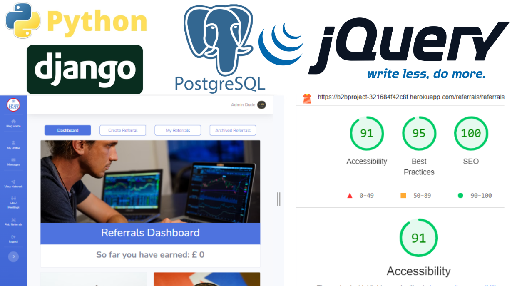

# B2B Net - Business Networking Platform:

B2B-Net stands at the forefront of business networking, tailored to amplify collaboration and prosperity within distinct localities. Designed as exclusive, paid groups, each with its own database and membership, B2B-Net serves as a dynamic hub for businesses to cultivate meaningful connections.

Key Features:

## Referral Excellence:

The Referral Logging System streamlines revenue opportunities, letting businesses log and manage referrals effortlessly.
An integrated commission system incentivizes active participation, rewarding businesses with a 5% commission on successful referrals.

## Strategic Meetings:

The One-to-One Meeting Booking feature fosters direct collaboration, encouraging businesses to schedule personalized meetings.
This capability enhances relationship-building, opening pathways for shared growth opportunities within the local community.

## Additional Features:

### Blog Posts for Community Updates:

Stay informed with group meetings, business services, and community highlights through interactive blog posts.

### Direct Messaging Chat App:

Enhance communication through a dedicated chat app, enabling users to connect through direct messages for seamless interaction.

### Comprehensive User Profiles:

Elevate networking with detailed user profiles, providing insights into businesses, services, and expertise.

### Data-Driven Dashboard:

A powerful dashboard analyzes referral data, offering insights into network performance, trends, and opportunities for strategic growth.

## Purpose and Impact:

B2B-Net goes beyond conventional networking platforms by empowering paid, exclusive groups with tailored databases. This unique approach enriches the local business ecosystem, driving economic growth through structured referrals and fostering partnerships that thrive on mutual benefit.

## Your Business, Your Network, Your Success:

B2B-Net is more than a platform; it's a strategic partner for businesses invested in their local community. Unlock the full potential of your network, stay informed through dynamic blog posts, engage effortlessly with the chat app, and harness the power of data through an intuitive dashboard. Elevate your business connections with B2B-Net.

*** AM I Responsive ***

<https://www.bootdey.com/snippets/view/light-contact-list> snippets

<!-- # https://stackoverflow.com/questions/43696074/django-private-messaging-conversation-view -->

Links to Git hub repository and live site login below

[Git Hub Repo - B2B Net](https://github.com/Bowlesy666/b2b-net)

[Live deployed site - B2B login](https://b2bproject-321684f42c8f.herokuapp.com/)

[Live deployed site - 404 page](https://b2bproject-321684f42c8f.herokuapp.com/404.html/)

___

## Contents

* [UX](#UX)
  * [User Stories](#User-Stories)

* [Design](#design)
  * [Wireframes](#wireframes)
  * [Colour Scheme](#colour-scheme)
  * [Typography](#typography)
  * [Imagery](#imagery)

* [Features](#features)
  * [General Features](#general-features)
  * [Future Implementations](#future-implementations)
  * [Accessibility](#accessibility)

* [Technologies Used](#technologies-used)
  * [Languages Used](#languages-used)
  * [Frameworks, Libraries & Programs Used](#frameworks-libraries--programs-used)

* [Deployment & Local Development](#deployment--local-development)
  * [Deployment](#deployment)
  * [Local Development](#local-development)
    * [How to Fork](#how-to-fork)
    * [How to Clone](#how-to-clone)

* [Testing](#testing)

* [Credits](#credits)
  * [Code Used](#code-used)
  * [Content](#content)
  * [Media](#media)
  * [Acknowledgments](#acknowledgments)

___

## UX

### User Stories

#### Target Audience

The target audience for **B2B-Net** includes:

- **Local Businesses Seeking Growth:**
  - Aspiring to expand business connections and increase revenue through strategic collaborations.

- **Community-Focused Entrepreneurs:**
  - Individuals committed to fostering community development and supporting local businesses.

- **Networking Enthusiasts:**
  - Professionals interested in a platform that facilitates effective and meaningful networking within their locality.

#### Goals

The goals for **B2B-Net** are:

- **Refine Business Connections:**
  - Provide a seamless platform for businesses to log and manage referrals, enhancing revenue opportunities.

- **Streamline Collaboration:**
  - Facilitate one-to-one meetings, encouraging collaboration and shared growth opportunities among local businesses.

- **Community Engagement through Blog Posts:**
  - Keep users informed about group meetings, business services, and community updates through interactive blog posts.

- **Enhanced Communication with Chat App:**
  - Foster direct communication among users through a dedicated chat app for quick and efficient interaction.

- **Insightful User Profiles:**
  - Elevate networking experiences with detailed user profiles, offering insights into businesses, services, and expertise.

- **Data-Driven Decision Making:**
  - Empower businesses with a comprehensive dashboard analyzing referral data, providing insights for strategic growth.

#### Mobile-First Approach

**B2B-Net** is designed with a mobile-first approach to cater to users who are constantly on the go or work in the field
 
 