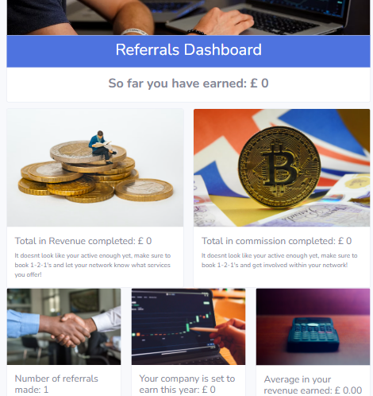
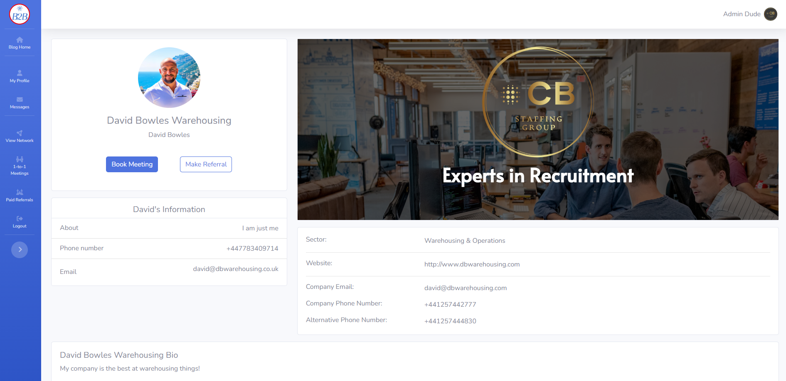
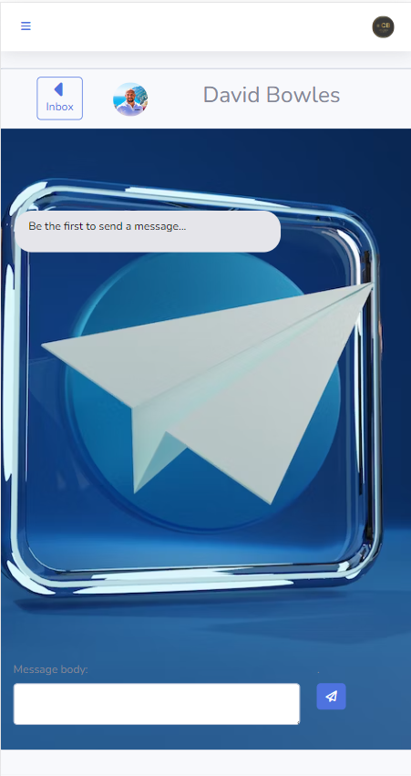
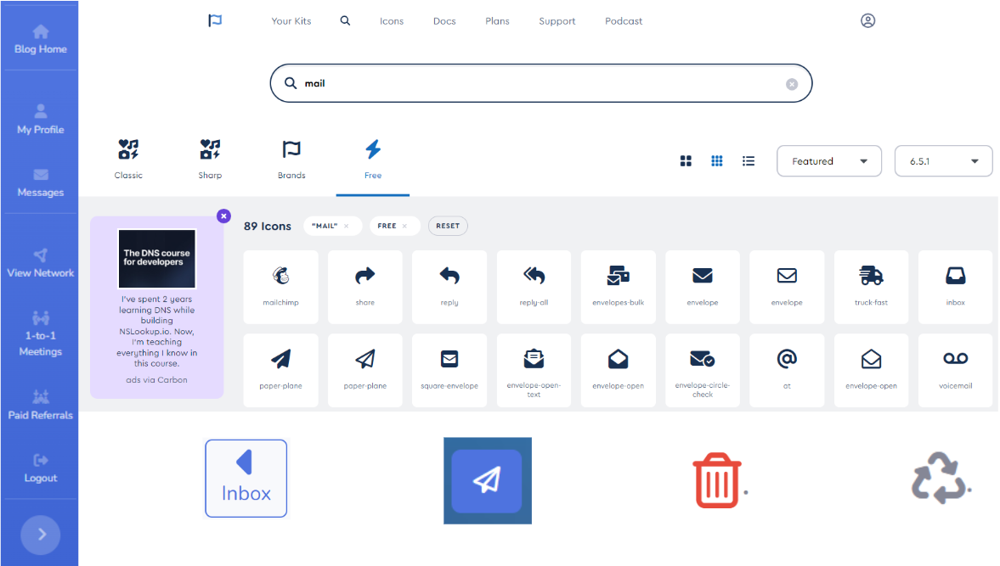
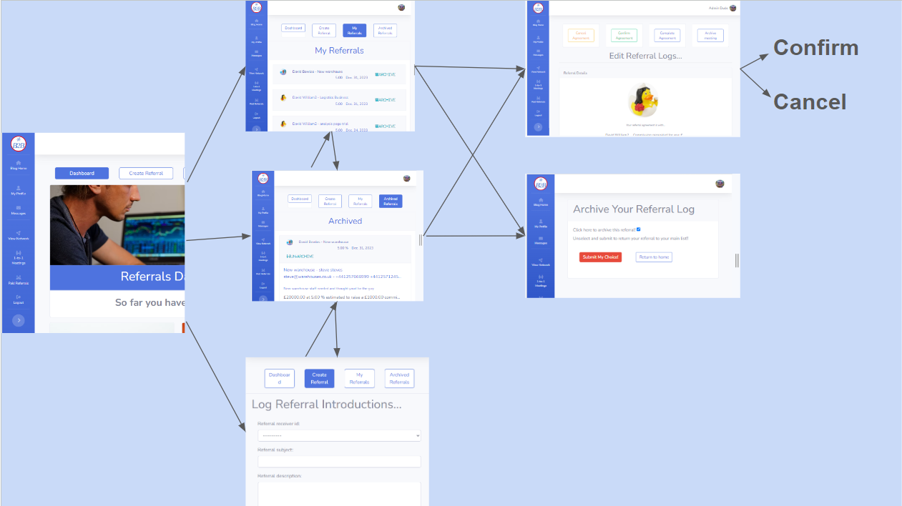
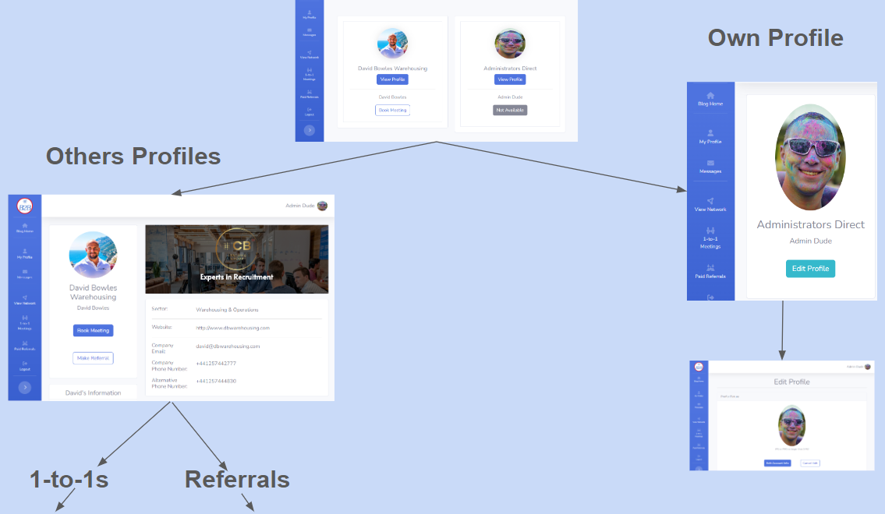
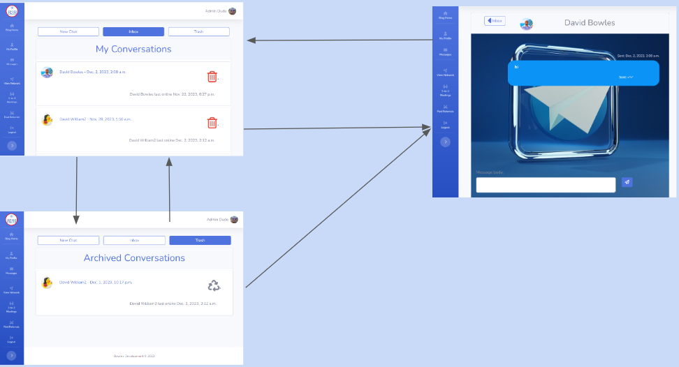
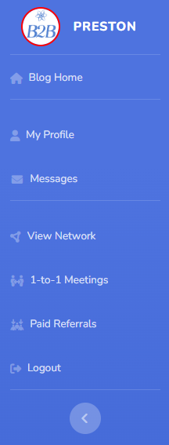

# B2B Net - Business Networking Platform

B2B-Net stands at the forefront of business networking, tailored to amplify collaboration and prosperity within distinct localities. Designed as exclusive, paid groups, each with its own database and membership, B2B-Net serves as a dynamic hub for businesses to cultivate meaningful connections.

Key Features:

## Referral Excellence

The Referral Logging System streamlines revenue opportunities, letting businesses log and manage referrals effortlessly.
An integrated commission system incentivizes active participation, rewarding businesses with a 5% commission on successful referrals.

## Strategic Meetings

The One-to-One Meeting Booking feature fosters direct collaboration, encouraging businesses to schedule personalized meetings.
This capability enhances relationship-building, opening pathways for shared growth opportunities within the local community.

## Additional Features

### Blog Posts for Community Updates

Stay informed with group meetings, business services, and community highlights through interactive blog posts.

### Direct Messaging Chat App

Enhance communication through a dedicated chat app, enabling users to connect through direct messages for seamless interaction.

### Comprehensive User Profiles

Elevate networking with detailed user profiles, providing insights into businesses, services, and expertise.

### Data-Driven Dashboard

A powerful dashboard analyzes referral data, offering insights into network performance, trends, and opportunities for strategic growth.

## Purpose and Impact

B2B-Net goes beyond conventional networking platforms by empowering paid, exclusive groups with tailored databases. This unique approach enriches the local business ecosystem, driving economic growth through structured referrals and fostering partnerships that thrive on mutual benefit.

## Your Business, Your Network, Your Success

B2B-Net is more than a platform; it's a strategic partner for businesses invested in their local community. Unlock the full potential of your network, stay informed through dynamic blog posts, engage effortlessly with the chat app, and harness the power of data through an intuitive dashboard. Elevate your business connections with B2B-Net.

***AM I Responsive***

<https://www.bootdey.com/snippets/view/light-contact-list> snippets

<!-- # https://stackoverflow.com/questions/43696074/django-private-messaging-conversation-view -->

Links to Git hub repository and live site login below with a test user credentials here if you dont fancy going through signup yourself(the passowrd here is generic and not one i have used previously or will in the future)

Username:

password:

[Git Hub Repo - B2B Net](https://github.com/Bowlesy666/b2b-net)

[Live deployed site - B2B Net login](https://b2bproject-321684f42c8f.herokuapp.com/)

[Live deployed site - 404 page](https://b2bproject-321684f42c8f.herokuapp.com/404.html/)

___

## Contents

- [B2B Net - Business Networking Platform](#b2b-net---business-networking-platform)
  - [Referral Excellence](#referral-excellence)
  - [Strategic Meetings](#strategic-meetings)
  - [Additional Features](#additional-features)
    - [Blog Posts for Community Updates](#blog-posts-for-community-updates)
    - [Direct Messaging Chat App](#direct-messaging-chat-app)
    - [Comprehensive User Profiles](#comprehensive-user-profiles)
    - [Data-Driven Dashboard](#data-driven-dashboard)
  - [Purpose and Impact](#purpose-and-impact)
  - [Your Business, Your Network, Your Success](#your-business-your-network-your-success)
  - [Contents](#contents)
  - [UX](#ux)
    - [User Stories](#user-stories)
      - [Target Audience](#target-audience)
      - [Goals](#goals)
      - [Mobile-First Approach](#mobile-first-approach)
  - [Epics \& Their User Stories](#epics--their-user-stories)
      - [User Stories](#user-stories-1)
  - [Design](#design)
    - [WireFrames](#wireframes)
      - [Login/out/404/signup](#loginout404signup)
      - [Base Template Layout](#base-template-layout)
      - [Referrals Dashboard](#referrals-dashboard)
      - [Various layouts](#various-layouts)
    - [Colour Scheme](#colour-scheme)
    - [Imagery](#imagery)
    - [Icons](#icons)
  - [Page Flow](#page-flow)

___

## UX

### User Stories

#### Target Audience

The target audience for **B2B-Net** includes:

* **Local Businesses Seeking Growth:**
  * Aspiring to expand business connections and increase revenue through strategic collaborations.

* **Community-Focused Entrepreneurs:**
  * Individuals committed to fostering community development and supporting local businesses.

* **Networking Enthusiasts:**
  * Professionals interested in a platform that facilitates effective and meaningful networking within their locality.

#### Goals

The goals for **B2B-Net** are:

* **Refine Business Connections:**
  * Provide a seamless platform for businesses to log and manage referrals, enhancing revenue opportunities.

* **Streamline Collaboration:**
  * Facilitate one-to-one meetings, encouraging collaboration and shared growth opportunities among local businesses.

* **Community Engagement through Blog Posts:**
  * Keep users informed about group meetings, business services, and community updates through interactive blog posts.

* **Enhanced Communication with Chat App:**
  * Foster direct communication among users through a dedicated chat app for quick and efficient interaction.

* **Insightful User Profiles:**
  * Elevate networking experiences with detailed user profiles, offering insights into businesses, services, and expertise.

* **Data-Driven Decision Making:**
  * Empower businesses with a comprehensive dashboard analyzing referral data, providing insights for strategic growth.

#### Mobile-First Approach

**B2B-Net** is designed with a mobile-first approach to cater to users who are constantly on the go or work in the field

## Epics & Their User Stories

#### User Stories

  
Epic: Admin Privileges

  <ul>
    <li>As a system administrator, I want the ability to manage user roles and permissions to maintain platform integrity.</li>
    <li>As a group administrator, I want the capability to oversee and moderate group-specific activities and discussions.</li>
  </ul>

  
Epic: Content Sharing and Discussions

  <ul>
    <li>As a community member, I want to share blog posts and updates to engage and inform other local businesses.</li>
    <li>As a user, I want to participate in discussions related to group meetings, services, and community events.</li>
    <li>As a content creator, I want the ability to manage and edit the content I share on the platform.</li>
  </ul>

  
Epic: Networking and Communication

  <ul>
    <li>As a business owner, I want to easily connect with other local businesses for potential collaboration.</li>
    <li>As a network enthusiast, I want efficient communication channels to foster connections within the community.</li>
    <li>As a user, I want notifications and updates on relevant networking opportunities and events.</li>
  </ul>

  
Epic: Referrals

  <ul>
    <li>As a business, I want to log and track referrals for a streamlined process of managing potential revenue opportunities.</li>
    <li>As a referring business, I want to earn a commission for successful referrals, encouraging active participation.</li>
    <li>As a user, I want insights and analytics on the performance of my referrals for strategic decision-making.</li>
  </ul>

  
Epic: User Registration and Profile

  <ul>
    <li>As a new user, I want a seamless registration process to quickly join the B2B-Net community.</li>
    <li>As a user, I want to create and manage a detailed profile showcasing my business, services, and expertise.</li>
    <li>As a returning user, I want a secure login process so my data is safe</li>
  </ul>

  
Epic: 1-to-1 Meetings

  <ul>
    <li>As a business owner, I want to schedule one-to-one meetings with other local businesses for personalized collaboration.</li>
    <li>As a user, I want the ability to manage and reschedule my one-to-one meetings within the platform.</li>
  </ul>

The Epics were carefully dissected into user stories, then further detailed into manageable tasks. These tasks were thoughtfully arranged into iterations and milestones, utilizing GitHub's Kanban project board and milestone features. This approach reflects a practical and effective use of Agile methodologies in project planning.

___

## Design

### WireFrames

Please see the link below for the wireframes markdown file, it shows the layout for the different screen sizes - mobile, ipad and laptop/desktop. created using Bootstrap4 elements and the base layout is taken from stratbootstraps sb-admin-2's free templates base html, link below.

[sb-admin-2](https://startbootstrap.com/theme/sb-admin-2)

#### Login/out/404/signup

These are the none authenticated user pages and all follow the same design with an image displayed on medium sized screens and above, includes details with links/buttons

[Click Me - I am the Wireframes Link for the unauthorised user pages](unauth-wireframes.md)

#### Base Template Layout

All the logged in user pages uses this base template to keep familiarity and build brand awareness, consisting of a side nav and a top bar that reduces to burger menus on smaller screeen sizes

[Click Me - I am the Wireframes Link for the base layout](unauth-wireframes.md)

#### Referrals Dashboard

Deesigned as a user friendly interface to gain further insight into progress made within the networking community. This is used as the home page as a statement for why each and every user is there... to increase revenue and earn commission!

[Click Me - I am the Wireframes Link for the referrals dashboard](unauth-wireframes.md)

#### Various layouts

Again building brand awareness and keeping in style the rest of the site utilises familiar layouts with changes to content

[Click Me - I am the Wireframes Link for the referrals dashboard](unauth-wireframes.md)

### Colour Scheme

The website prominently features Bootstrap's primary blue color, creating a cohesive and visually appealing user experience. This choice is not only aesthetically pleasing but also plays a crucial role in building brand awareness. By consistently using Bootstrap's primary blue, users quickly associate the website with the Bootstrap framework, reinforcing a sense of familiarity and trust.

The blue background serves to establish a clean and modern design, enhancing the overall readability and user engagement. To ensure optimal viewing across various devices, the blue tone was carefully adjusted during testing phases, striking a balance between vibrancy and usability, particularly on mobile devices. Here you can see the blue working well with the chat app that continues the blue theme. Background picture courtesy of unsplash which is free to use under the unsplash free tier.

Throughout the website, essential information is presented in a clear and contrasting manner

### Imagery

Imagery plays a pivotal role in enhancing the visual appeal and functionality of the website.

The Referral Analysis page especially leverages Bootstrap's grid layout, utilizing card elements to seamlessly present pictures and data on separate cards. This layout not only optimizes information organization but also provides a structured and user-friendly interface for analyzing referral data.

Profiles are enriched with personalized avatars, allowing users to add a distinctive touch to their online presence. Additionally, the inclusion of hero images featuring company logos or banners provides a professional and cohesive visual identity in keeping with the business to business networking platform.

The Chat App, designed for modern communication, embraces a well-presented image background, creating an immersive and visually pleasing environment for users engaged in direct messaging.

The thoughtful integration of imagery enhances the overall user experience, embodying a familiar chat app style with a scrolling message thread, user information at the top, and a standard input/submit section conveniently fixed at the bottom of the screen. This design choice seamlessly combines functionality with an aesthetically pleasing layout.

### Icons

Icons were utilised from fontawesome, the side nav bar standardises what they each represent and the features on offer with the platform

___

## Page Flow

### Multipage Website Design

Embracing a multipage design, our website ensures a user-friendly journey through segmented content, offering distinct pages for various functionalities. This approach enhances clarity and navigational ease, allowing users to intuitively locate information without feeling overwhelmed.

Each page is dedicated to specific features, fostering a focused user experience and enabling efficient communication of key concepts. Additionally, the multipage structure facilitates future scalability, providing a foundation for seamless expansion and incorporation of new features as the platform evolves.

#### Referrals and 1-to-1 Meetings Flow

The flows for these 2 features are the same. Create, Read, Update and 'Archive'. I chose archive for analytics purposes. Feature to be added would be to have delete option but analysis records kept.

#### User Profiles Flow

Everything interconnects from the profiles, users are able to quickly search in their networks closed group and directly book 1-2-1s, make referralds as well as see all their company and personal profile. Users can also update their own profile to keep information up to date and accurate

#### Chat App Flow

Chat app flow is simple, inbox, trash and the chat. The feature navigation buttons at the top were reduced in favour of a familiar 'back button with a caret to return to the inbox.

#### Blog Flow

The User blog takes on the usual flow expected with any social networking app, users can create read update and delete posts as well as like and comment.

### Logo and Title

Logo and title is simple and informs the users of their chosen network area, in this example it will be the Preston branch. Users are immediately aware they are expected and able to grow their network and revenue generating possibilities in this area.

___

## Features

### General Features

### General Features

* Developed with a mobile-first approach, ensuring responsiveness on larger screens through flexbox and Bootstrap4.

* Prioritizes accessibility compliance with thoughtfully chosen colors and html structure for users who use screen readers.

* Showcases a distinctive logo and title to resonate with the professional yet engaging theme of B2B networking.

* Thoughtfully arranges sections to strategically present information, facilitating a seamless user experience.

* Guides users with the use of focus for the chat app, directing them to relevant new messages efficiently and giving the user confirndence and familiarity.

* Enhances user experience with icons and a carefully crafted 404 page, maintaining the professional aesthetic of B2B-Net.

* Utilizes Bootstrap4 for layout styling and incorporates media queries and CSS order property for optimal display on diverse screens.

* Implements input validation through HTML and Python +Django, ensuring a smooth and error-free user interaction.

* Boosts user engagement with hover effects and Font Awesome icons for a modern and polished appearance.

* Utilizes Unsplash images for the visually appealing graphics, aligning with the professional tone of the platform. All pictures used are from the free to use section

* Strategically placed sections guide users through each apps processes seamlessly.

### Future Implementations

After researching the world of closed-group business networking, the key insight revealed that the platform itself serves as a significant selling point for these groups. Modernizing and enhancing this process has shifted the primary focus of the groups towards referrals and facilitating one-to-one meetings allowing group leaders the fredom to do what they do best and network instead of data collection and analysing.

I feel the design has lead to many future implimentation possibilities, potential future enhancements include:

* Stars rating system for users who are the most active in the closed network. Can be lead by many factors eg user reviews, user attendance to meetings, user interaction or a mix of all 3.

* Analytics to be imporved upon, many areas can eb added here.

* Online video meetings for the 1-to-1 meetings.

* 1-to-1 meeting calendar with double booking alerts and integration with google calendars etc.

* Blog to be upgraded to infinite scroll as well as a major facelift.

* Messaging system to be upgraded to a realtime chat app with the use of Django channels.

* Group chat facility

* Attached 'about' page for businesses looking to join the group.

* Email Backend, attempted with google but was unabel to impliment at this time.

### Accessibility

I have been checking that the website is accessible friendly at every stage using Lighthouse. I have also been mindful that I am:

* Using semantic HTML techniques.

* Using descriptive alt attributes on logo and links for the site.

* Providing clear direction and flow for the users with the use of bold icons and an intuative interface.

* Ensuring that there is a sufficient colour contrast throughout the site.

* Bold and colourful large text.

* Well spaced layout design.

* Adding ARIA (Accessible Rich Internet Applications) landmarks and roles to improve navigation for screen reader users.

* Providing text alternatives for non-text content, such as images, to ensure a comprehensive understanding for users relying on screen readers.

* Verifying that all form elements have proper labels and are associated with their corresponding inputs to facilitate a seamless experience for users with disabilities.

___

## Technology Used

### Languages Used

* HTML - page markup

* CSS - page styling

* Jquery - running functions for interactive components

* Python - using Django and other plugins ot develop the site

### Frameworks, Libraries Packages & Programs Used

* Flexbox

* Unsplash

* Google fonts

* Font Awesome

* Git for version control

* Github

* Heroku

* Elephant SQL

* Codeanywhere, many major issues with code anywhere recently resulting in restarting from scratch, will migrate back to gitpod for future sprints

* Favicongenerator.org

* Bootstrap4

* Cloudinary

* Balsamiq wireframing

* Google Dev Tools

* Validators - validator.w3.org, jigsaw.w3.org, https://pep8ci.herokuapp.com/#

* Stackoverflow / Django documentation / W3 schools / Google / Allauth docs / abstractapi.com /geeks for geeks

* Startboostrap for the starter template used in base.html

* Bootdey(profile feed card snippets) codepen.io(speach bubbles chat app) I ustilised snippets from

* gunicorn / allauth / crispyforms / summernote / psycopg2 / django-phonnumber-field / dj-database-url

___

## Deployment and local development

### Deployment

#### Pre-Deployment Tasks

* Ensure the requirements.txt file is up-to-date with correct Python module configurations.

* Create a Procfile to configure Heroku deployment for the Gunicorn web app.

* Update the ALLOWED_HOSTS list in settings.py with the Heroku app name and localhost.

* Configure all static files and directories in settings.py.

* Set up environment variables in env.py for sensitive information like SECRET_KEY, DATABASE_URL, CLOUDINARY_URL, and PORT.

##### Hidden Variables

* SECRET_KEY

* DATABASE_URL

* CLOUDINARY_URL

* PORT

#### Deploying on Heroku

1. Create a Heroku account and select "Create a new app."

2. Connect the app to GitHub for seamless deployment.

3. Enable automatic deploys from the main branch.

4. Configure environment variables in the settings tab.

5. Select buildpacks for Node.js and Python.

6. Deploy the app.

### Local development

#### Run Locally

1. Go to the GitHub repository.

2. Download and unzip the repository.

3. Create an env.py file for environment variables.

4. Ensure PostgreSQL is installed on your computer.

5. Create a virtual environment and run necessary commands (makemigrations, migrate, runserver).

#### How to clone & Fork

##### Clone

1. Go to the GitHub repository.

2. Click on the green "Code" button.

3. Copy the clone URL.

4. Open Git Bash and clone the repository using git clone [URL].

##### Fork

1. Go to the GitHub repository.

2. Click on the "Fork" button in the upper right-hand corner.

3. Edit the repository name and description if desired.

4. Click the green "Create Fork" button.

___

## Testing

### Validators

* HTML has been validated with [W3C HTML5 Validator](https://validator.w3.org/).
* CSS has been validated with [W3C CSS Validator](https://jigsaw.w3.org/css-validator/)
* Python has been validated with [Pep8](https://pep8ci.herokuapp.com/#)

No errors or warnings are returned when passed through any of the validators

### General Testing

### General Testing

* Each feature or section was tested using the validators and lighthouse at each stage for functionality and accessibility
* The forms input is validated by html and python and will not submit without the correct data type
* Family reviews were used for feedback

### Mobile Testing

* The site was built in mobile first style so has been tested primarily for this
* predominantly tested on Safari as all family have iPhones

### Desktop Testing

* Site was developed on a HP laptop using chrome, also tested on microsoft Edge towards the end of the coding stages

___

### Bugs

#### Fixed Bugs

#### Unfixed bugs

#### Goals

#### Testing

___

## Credits

___

Thank you for reviewing my project
